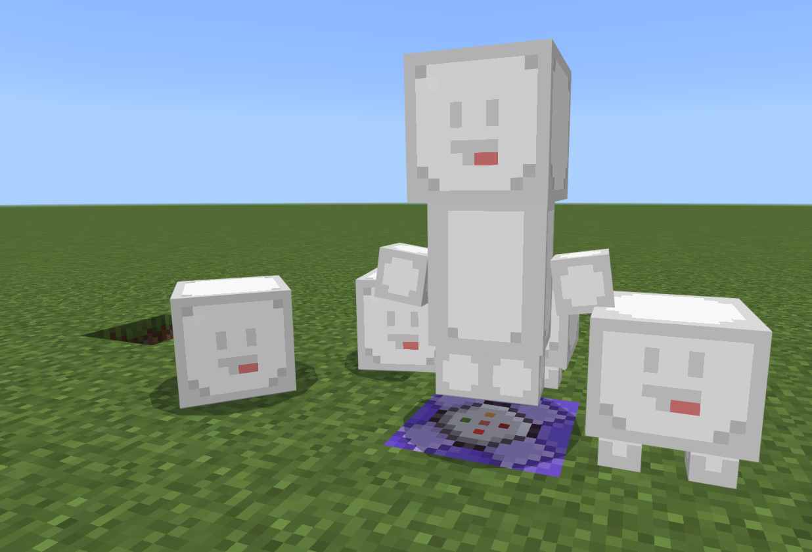

# Minecraft Bedrock Edition アドオンサンプル-エンティティ

マインクラフト統合版アドオンのエンティティ追加サンプルです。

## 機能

- ブランクなエンティティ(kaimtemp:blankentity)
- 動きまわるエンティティ(kaimtemp:movableentity)
- 家具エンティティ(向き固定,ブロック当たり判定,影なし)(kaimtemp:furniture)

